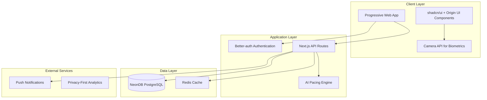

# Design Document

## Overview

The Chronic Fatigue Health Tracker is a Progressive Web App (PWA) designed to provide empathetic, evidence-based health management for individuals with ME/CFS and Long COVID. The application prioritizes minimal cognitive load through "vibe coding" principles while delivering comprehensive daily routine management, AI-powered pacing, and gentle movement guidance.

The architecture leverages modern web technologies to ensure accessibility, performance, and regulatory compliance while maintaining the flexibility to adapt to users' fluctuating energy levels and symptoms.

## Architecture

### High-Level Architecture



### Technology Stack

- **Frontend Framework**: Next.js 14+ with App Router
- **UI Components**: shadcn/ui with Origin UI design system
- **Authentication**: Better-auth for secure user management
- **Database**: NeonDB (PostgreSQL) with Drizzle ORM
- **Styling**: Tailwind CSS with custom design tokens
- **PWA**: Next-PWA for offline functionality
- **AI/ML**: TensorFlow.js for client-side biometric analysis
- **Deployment**: Vercel with edge functions
- **Monitoring**: Sentry for error tracking

### Design Principles

1. **Cognitive Load Minimization**: Every interaction designed to require minimal mental effort
2. **Energy-First Design**: All features consider user's fluctuating energy levels
3. **Privacy by Design**: GDPR compliance built into every component
4. **Accessibility First**: WCAG 2.1 AA compliance with chronic illness considerations
5. **Progressive Enhancement**: Core functionality works without JavaScript

## Components and Interfaces

### Core Components

#### 1. Daily Anchor Component
```typescript
interface DailyAnchorProps {
  userId: string;
  currentDate: Date;
  completionStatus: {
    breathing: boolean;
    mobility: boolean;
    stretches: boolean;
  };
  onComplete: (activity: string, duration: number) => void;
}
```

**Features:**
- Timer-based activity tracking
- Gentle progress indicators
- Calming visual feedback
- Voice guidance option for eyes-closed activities

#### 2. Energy Assessment Component
```typescript
interface EnergyAssessmentProps {
  currentLevel: number;
  onLevelChange: (level: number) => void;
  showMovementRecommendation: boolean;
  biometricData?: BiometricReading;
}
```

**Features:**
- Simple 1-10 energy scale with descriptive labels
- Visual energy meter with calming colors
- Integration with biometric readings
- Contextual movement session recommendations

#### 3. Biometric Capture Component
```typescript
interface BiometricCaptureProps {
  onReadingComplete: (data: BiometricReading) => void;
  isProcessing: boolean;
  errorState?: string;
}

interface BiometricReading {
  heartRate: number;
  hrv: number;
  timestamp: Date;
  confidence: number;
}
```

**Features:**
- Camera-based HRV and heart rate measurement
- Real-time feedback during capture
- Error handling for poor lighting/positioning
- Privacy-first local processing

#### 4. Gentle Movement Session Component
```typescript
interface MovementSessionProps {
  sessionType: 'warmup' | 'resistance' | 'flow' | 'cooldown';
  exercises: Exercise[];
  onPhaseComplete: (phase: string, selfCheck: SelfCheckRating) => void;
  userEnergyLevel: number;
}
```

**Features:**
- Adaptive exercise selection based on energy
- Built-in rest periods
- Post-session self-assessment
- Automatic session scaling

### API Interfaces

#### Authentication Service
```typescript
interface AuthService {
  signUp(email: string, password: string): Promise<User>;
  signIn(email: string, password: string): Promise<Session>;
  signOut(): Promise<void>;
  resetPassword(email: string): Promise<void>;
  updateProfile(data: Partial<UserProfile>): Promise<User>;
}
```

#### Health Data Service
```typescript
interface HealthDataService {
  logDailyAnchor(data: DailyAnchorLog): Promise<void>;
  logSymptoms(data: SymptomLog): Promise<void>;
  logBiometrics(data: BiometricReading): Promise<void>;
  getHealthTrends(userId: string, dateRange: DateRange): Promise<HealthTrends>;
  generateReport(userId: string, format: 'pdf' | 'json'): Promise<Report>;
}
```

#### AI Pacing Service
```typescript
interface AIPacingService {
  analyzePacingNeeds(userData: UserHealthData): Promise<PacingRecommendation>;
  predictEnergyLevels(historicalData: HealthTrends): Promise<EnergyForecast>;
  adaptRoutine(baseRoutine: Routine, userState: UserState): Promise<AdaptedRoutine>;
}
```

## Data Models

### User Profile
```typescript
interface UserProfile {
  id: string;
  email: string;
  createdAt: Date;
  preferences: {
    notifications: NotificationSettings;
    accessibility: AccessibilitySettings;
    privacy: PrivacySettings;
  };
  medicalInfo?: {
    conditions: ('ME/CFS' | 'Long COVID' | 'Other')[];
    diagnosisDate?: Date;
    severity: 'Mild' | 'Moderate' | 'Severe';
  };
}
```

### Daily Health Log
```typescript
interface DailyHealthLog {
  id: string;
  userId: string;
  date: Date;
  dailyAnchor: {
    breathing: { completed: boolean; duration?: number; };
    mobility: { completed: boolean; duration?: number; };
    stretches: { completed: boolean; duration?: number; };
  };
  nutrition: {
    oneProductFoods: string[];
    thousandYearFoods: string[];
    hydration: number; // liters
  };
  supplements: {
    magnesium: boolean;
    vitaminD: boolean;
    other: string[];
  };
  sleep: {
    blueLight: boolean;
    screenReplacement: boolean;
    environment: boolean;
  };
  energyLevel: number; // 1-10
  symptoms: SymptomRating[];
  biometrics?: BiometricReading[];
}
```

### Movement Session
```typescript
interface MovementSession {
  id: string;
  userId: string;
  date: Date;
  preSessionEnergy: number;
  phases: {
    warmup: PhaseCompletion;
    resistance: PhaseCompletion;
    flow: PhaseCompletion;
    cooldown: PhaseCompletion;
  };
  postSessionCheck: {
    fatigue: number;
    breath: number;
    stability: number;
  };
  adaptations: string[]; // AI-suggested modifications
}
```

## Error Handling

### Client-Side Error Handling
- **Network Errors**: Graceful offline mode with local storage
- **Camera Errors**: Clear instructions for optimal positioning
- **Validation Errors**: Gentle, supportive error messages
- **Performance Issues**: Automatic quality reduction for older devices

### Server-Side Error Handling
- **Database Errors**: Automatic retry with exponential backoff
- **Authentication Errors**: Secure error messages without information leakage
- **Rate Limiting**: Gentle notifications about usage limits
- **Data Validation**: Comprehensive input sanitization

### Error Recovery Strategies
```typescript
interface ErrorRecoveryStrategy {
  retryAttempts: number;
  backoffStrategy: 'linear' | 'exponential';
  fallbackBehavior: 'offline' | 'cached' | 'simplified';
  userNotification: 'silent' | 'gentle' | 'informative';
}
```

## Testing Strategy

### Unit Testing
- **Component Testing**: React Testing Library for UI components
- **Service Testing**: Jest for business logic and API services
- **Utility Testing**: Pure function testing for calculations
- **Accessibility Testing**: Automated a11y testing with jest-axe

### Integration Testing
- **API Testing**: Supertest for endpoint validation
- **Database Testing**: Test database with realistic data scenarios
- **Authentication Flow**: End-to-end auth testing
- **Biometric Processing**: Mock camera input testing

### User Acceptance Testing
- **Chronic Illness Community**: Beta testing with actual patients
- **Accessibility Testing**: Testing with assistive technologies
- **Performance Testing**: Testing on low-end devices
- **Cognitive Load Testing**: Usability testing during fatigue episodes

### Automated Testing Pipeline


### Testing Considerations for Chronic Illness Users
- **Fatigue Simulation**: Testing UI during simulated cognitive fatigue
- **Motor Impairment**: Testing with limited fine motor control
- **Visual Sensitivity**: Testing with various contrast and brightness settings
- **Attention Span**: Testing task completion with interruptions

## Security and Privacy

### Data Protection Measures
- **Encryption**: AES-256 encryption for data at rest
- **Transport Security**: TLS 1.3 for all communications
- **Access Control**: Role-based permissions with principle of least privilege
- **Data Minimization**: Collect only necessary health data
- **Anonymization**: Remove PII from analytics and research data

### GDPR Compliance Implementation
- **Consent Management**: Granular consent for different data uses
- **Data Portability**: Export functionality in standard formats
- **Right to Erasure**: Complete data deletion within 30 days
- **Breach Notification**: Automated breach detection and reporting
- **Privacy by Design**: Built-in privacy controls in every feature

### Authentication Security
```typescript
interface SecurityConfig {
  passwordPolicy: {
    minLength: 12;
    requireSpecialChars: true;
    requireNumbers: true;
    preventCommonPasswords: true;
  };
  sessionManagement: {
    maxAge: '7d';
    renewalThreshold: '1d';
    concurrentSessions: 3;
  };
  twoFactorAuth: {
    optional: true;
    methods: ['totp', 'email'];
  };
}
```

## Performance Optimization

### Client-Side Optimization
- **Code Splitting**: Route-based and component-based splitting
- **Image Optimization**: Next.js Image component with WebP support
- **Caching Strategy**: Service worker for offline functionality
- **Bundle Size**: Tree shaking and dynamic imports
- **Core Web Vitals**: Optimized for LCP, FID, and CLS metrics

### Server-Side Optimization
- **Database Indexing**: Optimized queries for health data retrieval
- **Caching Layer**: Redis for frequently accessed data
- **Edge Functions**: Geographically distributed API responses
- **Connection Pooling**: Efficient database connection management

### Accessibility Performance
- **Reduced Motion**: Respect user's motion preferences
- **High Contrast**: Optimized rendering for high contrast mode
- **Screen Reader**: Semantic HTML and ARIA labels
- **Keyboard Navigation**: Full keyboard accessibility

This design provides a comprehensive foundation for building an empathetic, technically robust health tracking application that prioritizes the unique needs of chronic fatigue patients while maintaining modern web standards and regulatory compliance.